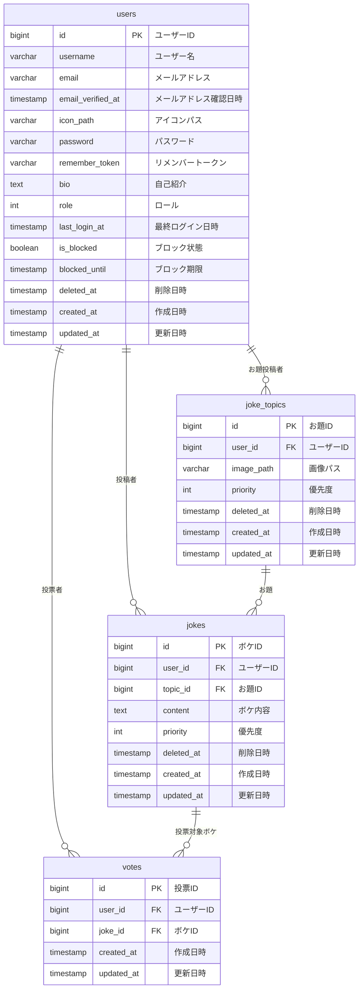

# DBテーブル設計

## テーブル一覧

| テーブル名 | 説明 |
|-----------|------|
| [users](./users.md) | ユーザ情報管理テーブル |
| [joke_topics](./joke_topics.md) | ボケのお題管理テーブル |
| [jokes](./jokes.md) | ボケ管理テーブル |
| [votes](./votes.md) | いいね投票管理テーブル |
| [personal_access_tokens](./personal_access_tokens.md) | アクセストークン管理テーブル |
| [password_reset_tokens](./password_reset_tokens.md) | パスワードリセットトークン管理テーブル |
| [failed_jobs](./failed_jobs.md) | 失敗したジョブ管理テーブル |

## ER図

