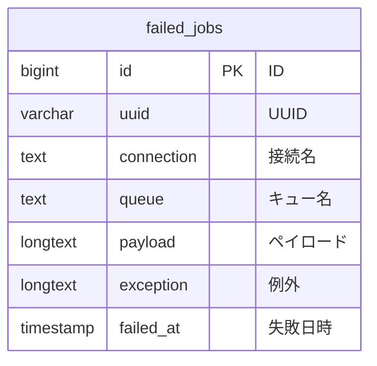

# failed_jobs テーブル

## テーブル名
failed_jobs

## 説明
Laravelキュー処理で失敗したジョブを記録するテーブル。

## カラム定義

| 物理名 | 論理名 | 型 | キー | デフォルト | NULL | 説明 |
|--------|--------|-----|------|-----------|------|------|
| id | ID | BIGINT (AUTO_INCREMENT) | PRIMARY KEY | | NOT NULL | ID |
| uuid | UUID | VARCHAR(255) | UNIQUE | | NOT NULL | ジョブの一意識別子 |
| connection | 接続名 | TEXT | | | NOT NULL | キュー接続名 |
| queue | キュー名 | TEXT | | | NOT NULL | キュー名 |
| payload | ペイロード | LONGTEXT | | | NOT NULL | ジョブのシリアライズされたデータ |
| exception | 例外 | LONGTEXT | | | NOT NULL | 失敗時の例外情報 |
| failed_at | 失敗日時 | TIMESTAMP | | CURRENT_TIMESTAMP | NOT NULL | ジョブが失敗した日時 |

## インデックス
- id (PRIMARY KEY)
- uuid (UNIQUE)

## リレーション

