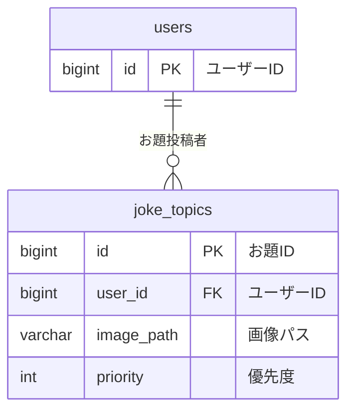

# joke_topics テーブル

## テーブル名
ボケのお題管理テーブル

## 説明
ユーザーがアップしたボケのお題を管理するテーブル。

## マイグレーション

```php
Schema::create('joke_topics', function (Blueprint $table) {
    $table->id();
    $table->foreignId('user_id')->constrained('users')->onDelete('cascade')->onUpdate('cascade');
    $table->string('image_path')->nullable();
    $table->integer('priority')->nullable()->default(0);
    $table->timestamps();
    $table->softDeletes();
    $table->index('priority');
});
```

## カラム定義

| 物理名 | 論理名 | 型 | キー | デフォルト | NULL | 説明 |
|--------|--------|-----|------|-----------|------|------|
| id | ID | unsigned BIGINT | PRIMARY KEY | | NOT NULL | お題ID |
| user_id | ユーザーID | unsigned BIGINT | FOREIGN KEY → users.id | | NOT NULL | お題を投稿したユーザーのID |
| image_path | 画像パス | VARCHAR(255) | | | NULL | ボケお題画像のパス |
| priority | 優先度 | INT | INDEX | 0 | NULL | 表示優先度（数値が大きいほど優先など） |
| created_at | 作成日時 | TIMESTAMP | | | NULL | レコード作成日時（Laravel標準） |
| updated_at | 更新日時 | TIMESTAMP | | | NULL | レコード更新日時（Laravel標準） |
| deleted_at | 削除日時 | TIMESTAMP | | | NULL | ソフトデリート日時 |

## インデックス
- id (PRIMARY KEY)
- priority (INDEX)

## ユニーク制約
- なし

## リレーション


