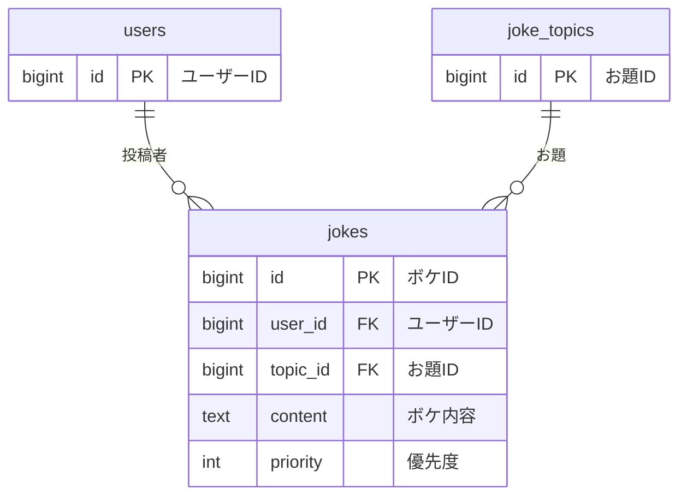

# jokes テーブル

## テーブル名
ボケ管理テーブル

## 説明
トピックに紐づくボケを管理するテーブル。
ボケの内容や表示優先度などを管理している。

## マイグレーション

```php
Schema::create('jokes', function (Blueprint $table) {
    $table->id();
    $table->foreignId('user_id')->constrained('users')->onDelete('cascade');
    $table->foreignId('topic_id')->constrained('joke_topics')->onDelete('cascade');
    $table->text('content');
    $table->integer('priority')->default(0);
    $table->timestamps();
    $table->softDeletes();
});
```

## カラム定義

| 物理名 | 論理名 | 型 | キー | デフォルト | NULL | 説明 |
|--------|--------|-----|------|-----------|------|------|
| id | ID | unsigned BIGINT | PRIMARY KEY | | NOT NULL | ボケID |
| user_id | ユーザーID | unsigned BIGINT | FOREIGN KEY → users.id | | NOT NULL | ボケを投稿したユーザーのID |
| topic_id | お題ID | unsigned BIGINT | FOREIGN KEY → joke_topics.id | | NOT NULL | 紐づくお題のID |
| content | ボケ内容 | TEXT | | | NOT NULL | ボケの本文 |
| priority | 優先度 | INT | | 0 | NOT NULL | 表示優先度（数値が大きいほど優先など） |
| created_at | 作成日時 | TIMESTAMP | | | NULL | レコード作成日時（Laravel標準） |
| updated_at | 更新日時 | TIMESTAMP | | | NULL | レコード更新日時（Laravel標準） |
| deleted_at | 削除日時 | TIMESTAMP | | | NULL | ソフトデリート日時 |

## インデックス
- id (PRIMARY KEY)
- user_id (FOREIGN KEY)
- topic_id (FOREIGN KEY)
- priority

## ユニーク制約
- なし

## リレーション


