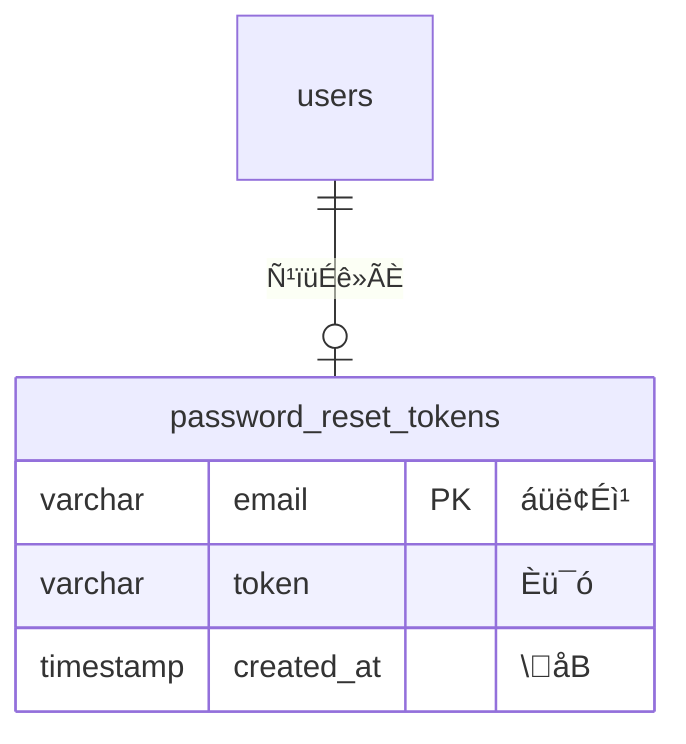

# password_reset_tokens ÆüÖë

## ÆüÖë
password_reset_tokens

## ¬
ѹïüÉê»ÃÈ(nÈü¯ó’¡Y‹ÆüÖë

## «éàš©

| i
 | Ö
 | ‹ | ­ü | ÇÕ©ëÈ | NULL | ¬ |
|--------|--------|-----|------|-----------|------|------|
| email | áüë¢Éì¹ | VARCHAR(255) | PRIMARY KEY | | NOT NULL | ѹïüÉê»ÃÈşanáüë¢Éì¹ |
| token | Èü¯ó | VARCHAR | | | NOT NULL | ѹïüÉê»ÃÈ(Èü¯ó |
| created_at | \åB | TIMESTAMP | | | NULL | Èü¯ó\åB |

## ¤óÇï¹
- email (PRIMARY KEY)

## êìü·çó

