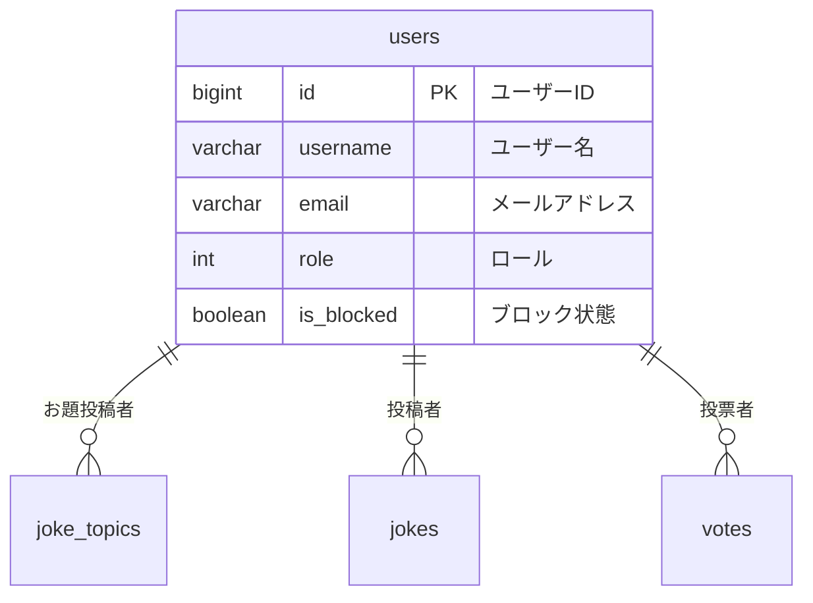

# users テーブル

## テーブル名
ユーザ情報管理テーブル

## 説明
ユーザ情報を管理するテーブル。

## マイグレーション

```php
Schema::create('users', function (Blueprint $table) {
    $table->bigIncrements('id'); // ユーザーID
    $table->string('username')->unique(); // ユーザー名
    $table->string('email')->unique(); // メールアドレス
    $table->timestamp('email_verified_at')->nullable(); // メールアドレス確認日時
    $table->string('icon_path')->nullable(); // アイコンパス
    $table->string('password'); // パスワード
    $table->rememberToken(); // リメンバートークン
    $table->text('bio')->nullable(); // 自己紹介
    $table->integer('role')->default(0); // ロール
    $table->timestamp('last_login_at')->nullable(); // 最終ログイン日時
    $table->boolean('is_blocked')->default(false); // ブロック状態
    $table->timestamp('blocked_until')->nullable(); // ブロック期限
    $table->softDeletes();
    $table->timestamps();
    // index
    $table->index('username');
    $table->index('email');
    $table->index('role');
    $table->index('is_blocked');
});
```

## カラム定義

| 物理名 | 論理名 | 型 | キー | デフォルト | NULL | 説明 |
|--------|--------|-----|------|-----------|------|------|
| id | ID | BIGINT (AUTO_INCREMENT) | PRIMARY KEY | | NOT NULL | ユーザーID |
| username | ユーザー名 | VARCHAR(255) | UNIQUE / INDEX | | NOT NULL | ユーザー名 |
| email | メールアドレス | VARCHAR(255) | UNIQUE / INDEX | | NOT NULL | メールアドレス |
| email_verified_at | メールアドレス確認日時 | TIMESTAMP | | | NULL | メールアドレスの確認日時 |
| icon_path | アイコンパス | VARCHAR(255) | | | NULL | ユーザーアイコン画像のパス |
| password | パスワード | VARCHAR(255) | | | NOT NULL | ハッシュ化されたパスワード |
| remember_token | リメンバートークン | VARCHAR(100) | | | NULL | ログイン状態保持用トークン |
| bio | 自己紹介 | TEXT | | | NULL | 自己紹介文 |
| role | ロール | INT | INDEX | 0 | NOT NULL | 権限レベル（0: 一般 など） |
| last_login_at | 最終ログイン日時 | TIMESTAMP | | | NULL | 最後にログインした日時 |
| is_blocked | ブロック状態 | BOOLEAN | INDEX | false | NOT NULL | ブロックされているかどうか |
| blocked_until | ブロック期限 | TIMESTAMP | | | NULL | ブロック解除予定日時 |
| created_at | 作成日時 | TIMESTAMP | | | NULL | レコード作成日時（Laravel標準） |
| updated_at | 更新日時 | TIMESTAMP | | | NULL | レコード更新日時（Laravel標準） |
| deleted_at | 削除日時 | TIMESTAMP | | | NULL | ソフトデリート日時 |

## インデックス
- id (PRIMARY KEY)
- username (UNIQUE, INDEX)
- email (UNIQUE, INDEX)
- role (INDEX)
- is_blocked (INDEX)

## ユニーク制約
- username
- email

## リレーション


