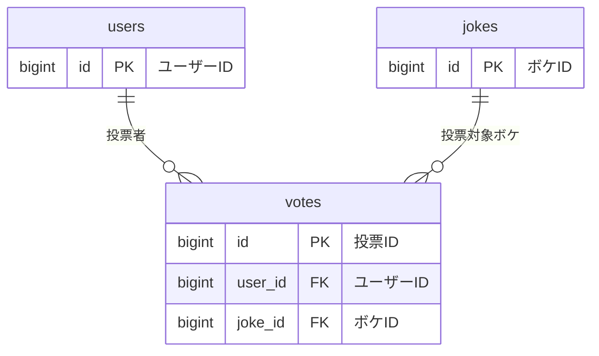

# votes テーブル

## テーブル名
いいね投票管理テーブル

## 説明
ユーザーがボケに対して「いいね（投票）」した履歴を管理するテーブル。
`users` と `jokes` の中間テーブルとして機能する。

## マイグレーション

```php
Schema::create('votes', function (Blueprint $table) {
    $table->id();
    $table->foreignId('user_id')->constrained()->onDelete('cascade');
    $table->foreignId('joke_id')->constrained()->onDelete('cascade');
    $table->timestamps();
    // ユーザーごとに1つのジョークに1回だけ投票可能
    $table->unique(['user_id', 'joke_id']);
});
```

## カラム定義

| 物理名 | 論理名 | 型 | キー | デフォルト | NULL | 説明 |
|--------|--------|-----|------|-----------|------|------|
| id | ID | unsigned BIGINT | PRIMARY KEY | | NOT NULL | 投票ID |
| user_id | ユーザーID | unsigned BIGINT | FOREIGN KEY → users.id / UNIQUE複合キー | | NOT NULL | 投票したユーザーのID |
| joke_id | ボケID | unsigned BIGINT | FOREIGN KEY → jokes.id / UNIQUE複合キー | | NOT NULL | 投票対象のボケのID |
| created_at | 作成日時 | TIMESTAMP | | | NULL | 投票した日時（Laravel標準） |
| updated_at | 更新日時 | TIMESTAMP | | | NULL | レコード更新日時（Laravel標準） |

## インデックス
- id (PRIMARY KEY)
- user_id (FOREIGN KEY, UNIQUE複合キーの一部)
- joke_id (FOREIGN KEY, UNIQUE複合キーの一部)
- user_id + joke_id (UNIQUE)

## ユニーク制約
- user_id + joke_id

## リレーション


